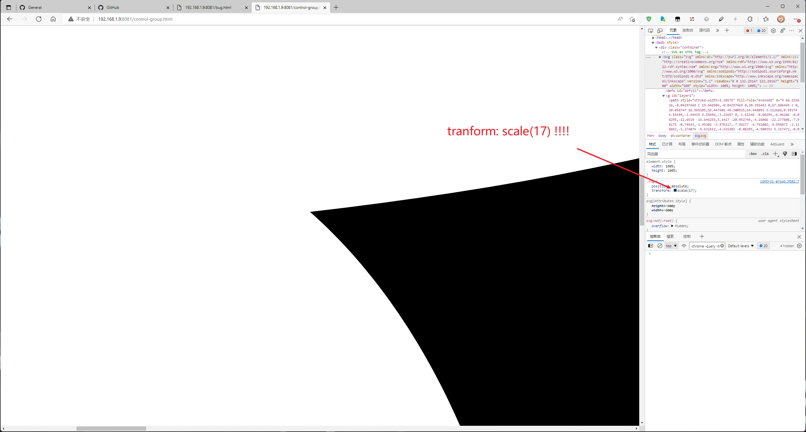

# strange-svg-bug-reproduce

Trying to reappear a strange SVG bug.

## Steps

1. npm install -g http-server
2. http-server ./ -c0
3. open ./bug.html
4. try to change transform value of element ".container"
5. You will see the jaggies (maybe...)

## Bugs

* bug 1（scale a background-image-SVG cause jaggies）

* bug 2

* control-group 1（chrome、write SVG directly in HTML）

* control-group 2（firefox、SVG as background-image）

